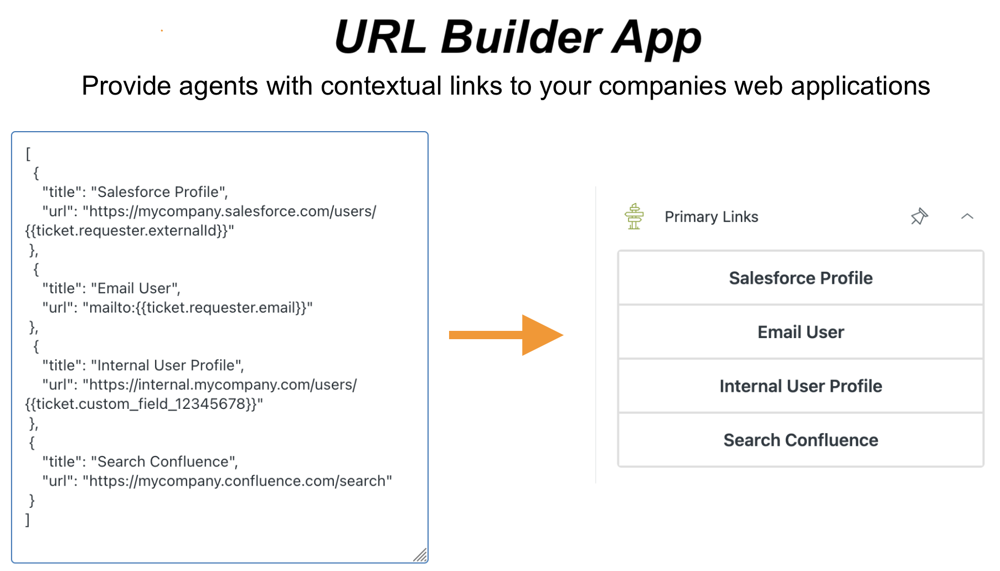

[](https://github.com/Ibotta/url_builder_app/actions/workflows/build.yaml)
[](LICENSE)
[](code_of_conduct.md)

# URL Builder App



**NOTE: This app is not currently on the Zendesk Marketplace.** Please follow the [Usage Instructions](#usage) to use this in your Zendesk domain.

## Overview

The URL Builder App is a Zendesk Support app that creates dynamic, clickable buttons in the ticket sidebar. It transforms static URLs into context-aware links by automatically populating them with ticket data, user information, and custom fields using Zendesk placeholders.

### Key Benefits
- **Streamline agent workflows** - Eliminate manual copy-pasting of ticket data
- **Quick external tool access** - Connect directly to CRMs, knowledge bases, and other systems
- **Dynamic URL generation** - URLs automatically populate with current ticket context
- **Simple configuration** - No coding required, just JSON configuration

## Quick Start

1. **Download** the latest `app-<DATE>.zip` from [Releases](https://github.com/Ibotta/url_builder_app/releases)
2. **Upload** to your Zendesk instance via Admin Center > Apps and integrations > Upload private app
3. **Configure** URL templates in the app settings
4. **Use** the generated buttons in your ticket sidebar

## Installation

### Prerequisites
```bash
"node": ">=22.18.0",
"@zendesk/zcli": "^1.0.0-beta.51"  # Only needed for development
```

### Option 1: Install from Release (Recommended)

1. Download the latest `app-<DATE>.zip` from [Releases](https://github.com/Ibotta/url_builder_app/releases)
2. In Zendesk Admin Center, navigate to **Apps and integrations** > **Zendesk Support Apps**
3. Click **Upload private app**
4. Enter an App Name (e.g., "URL Builder App")
5. Select the downloaded ZIP file
6. Click **Upload**, then **Agree and upload this App**
7. Click **Install** when prompted

### Option 2: Build from Source

For developers who want to modify the app, see the [Contributing Guide](./.github/CONTRIBUTING.md#compile-and-deploy-from-source).

## Configuration

### Basic Setup

After installation, configure your URL templates:

1. In Zendesk Admin Center, go to **Apps & Integrations** > **Zendesk Support Apps**
2. Find your installed URL Builder App in the **Private Apps** section and click the **Settings** (gear) icon
3. In the **URI Templates** field, enter a JSON array of your desired URLs

### Example Configuration

```json
[
  {
    "title": "Email Customer",
    "url": "mailto:{{ticket.requester.email}}"
  },
  {
    "title": "Search Customer in CRM",
    "url": "https://yourcrm.com/search?email={{ticket.requester.email}}"
  },
  {
    "title": "View Ticket Details",
    "url": "https://yourdomain.zendesk.com/agent/tickets/{{ticket.id}}"
  }
]
```

This configuration creates three buttons in your ticket sidebar that automatically populate with current ticket data.

## Advanced Usage

### Static URL Example

For basic links that don't need dynamic data:

```json
[
  {
    "title": "Company Knowledge Base",
    "url": "https://help.yourcompany.com"
  },
  {
    "title": "Internal Wiki",
    "url": "https://wiki.yourcompany.com"
  }
]
```

### Available Zendesk Placeholders

You can use any Zendesk object property as a placeholder in your URLs. Here are commonly used examples:

#### Ticket Properties
```
{{ticket.id}}                    - Ticket ID
{{ticket.subject}}               - Ticket subject
{{ticket.description}}           - Ticket description  
{{ticket.status}}                - Ticket status (new, open, pending, etc.)
{{ticket.priority}}              - Ticket priority
{{ticket.custom_field_XXXXXXX}}  - Custom field (replace XXXXXXX with field ID)
```

#### Requester (Customer) Properties
```
{{ticket.requester.id}}          - Customer user ID
{{ticket.requester.name}}        - Customer name
{{ticket.requester.email}}       - Customer email
{{ticket.requester.externalId}}  - External customer ID
```

#### Assignee Properties
```
{{ticket.assignee.user.id}}      - Assigned agent ID
{{ticket.assignee.user.name}}    - Assigned agent name
{{ticket.assignee.user.email}}   - Assigned agent email
{{ticket.assignee.group.id}}     - Assigned group ID
{{ticket.assignee.group.name}}   - Assigned group name
```

#### Current User Properties
```
{{currentUser.id}}               - Current agent ID
{{currentUser.name}}             - Current agent name
{{currentUser.email}}            - Current agent email
```

#### Organization Properties
```
{{ticket.organization.id}}                              - Organization ID
{{ticket.organization.name}}                            - Organization name
{{ticket.organization.organization_fields.XXXXXXX}}     - Custom org field
```

For the complete list of available properties, see the [Zendesk Apps API Reference](https://developer.zendesk.com/api-reference/apps/introduction/).

### Real-World Examples

#### CRM Integration
```json
[
  {
    "title": "Customer Profile in Salesforce",
    "url": "https://yourcompany.salesforce.com/search?email={{ticket.requester.email}}"
  },
  {
    "title": "Create Lead",
    "url": "https://yourcompany.salesforce.com/lead/create?name={{ticket.requester.name}}&email={{ticket.requester.email}}"
  }
]
```

#### Communication Tools
```json
[
  {
    "title": "Email Customer",
    "url": "mailto:{{ticket.requester.email}}?subject=Re: {{ticket.subject}}"
  },
  {
    "title": "Slack Customer Channel",
    "url": "https://yourcompany.slack.com/channels/customer-{{ticket.requester.id}}"
  }
]
```

### Working with Custom Fields

Zendesk allows [custom fields](https://support.zendesk.com/hc/en-us/articles/4420210121114-Using-custom-fields) on tickets, users, and organizations. These can be used in your URL templates.

#### Finding Custom Field IDs

1. In Zendesk Admin Center, go to **Objects and rules** > **Tickets** > **Fields**
2. Click on your custom field
3. Copy the Field ID from the URL or field details

#### Using Custom Fields in URLs

```json
[
  {
    "title": "Search by Issue Type",
    "url": "https://yourcompany.com/issues?customer_id={{ticket.requester.id}}&type={{ticket.custom_field_1234567890}}"
  }
]
```

**Important:** URLs with custom fields don't update automatically when the field changes. Agents need to refresh the page to see updated URLs.

## Troubleshooting

### App Shows Spinner Indefinitely
- **Cause:** No URI templates configured or invalid JSON format
- **Solution:** Check your JSON configuration in app settings

### Buttons Don't Show Expected Data
- **Cause:** Placeholder field doesn't exist or is empty
- **Solution:** Verify the field name and that it contains data for the current ticket

### URLs Don't Update When Fields Change
- **Cause:** This is expected behavior for performance reasons
- **Solution:** Refresh the page after making field changes

## Development

For developers interested in contributing or modifying the app, see the [Contributing Guide](./.github/CONTRIBUTING.md).

## Support

### Getting Help

- **Issues & Bug Reports**: [GitHub Issues](https://github.com/Ibotta/url_builder_app/issues)
- **General Questions**: [GitHub Discussions](https://github.com/Ibotta/url_builder_app/discussions)
- **OSS Compliance**: osscompliance@ibotta.com

When reporting issues, please include:
- Your Zendesk instance details
- App configuration (URI templates)
- Steps to reproduce the problem
- Expected vs actual behavior

**Security Note**: When sharing URI templates for support purposes, please review your company's security policies and remove any sensitive or confidential information such as:
- Internal domain names or URLs
- API keys or authentication tokens
- Customer data or personally identifiable information (PII)
- Proprietary system names or endpoints

Consider using placeholder values (e.g., `https://your-crm.com` instead of actual URLs) when providing configuration examples.